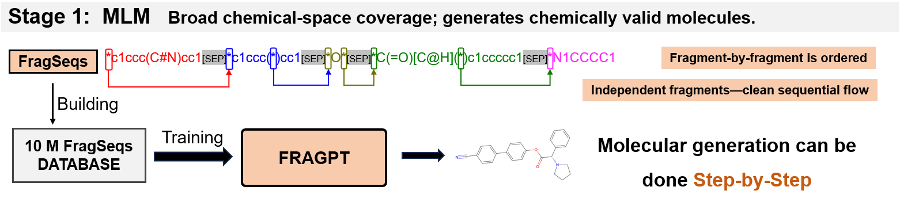
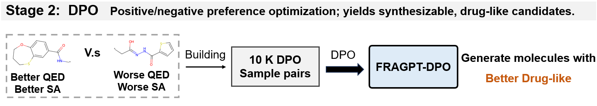
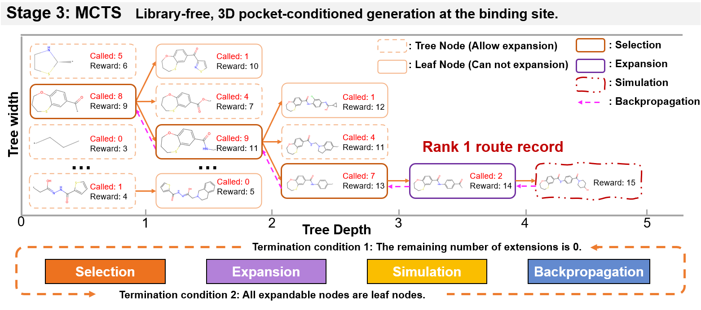

# Toward Closed-loop Molecular Discovery via Language Model, Property Alignment and Strategic Search

This is the official code repository for the paper: Toward Closed-loop Molecular Discovery via Language Model, Property Alignment and Strategic Search.

In our paper, we introduce:

- **Fragment-based Generative Pre-trained Transformer (FragGPT):** A molecular language model designed for context-aware fragment assembly, enabling the construction of novel molecular structures from a learned vocabulary of chemical fragments.

  

- **Chemical Property Alignment with Direct Preference Optimization (DPO):** A reinforcement learning technique to align the generative process with desirable pharmacological properties, enforcing physicochemical and synthetic feasibility to produce more drug-like candidates.

  

- **Target-aware Molecular Generation via Monte Carlo Tree Search (MCTS):** A guided search strategy that balances the exploration of novel chemotypes and the exploitation of promising intermediates, optimizing ligand generation directly within the context of a specific protein binding pocket.

  

## Installation

The required environmental dependencies for this project are listed in the `environment.yml` file. You can easily create and activate the environment using Conda:

```bash
conda env create -f environment.yml
conda activate your_env_name
```

## Hardware Requirements

A single run of the code requires less than 2000MB of VRAM. An NVIDIA RTX 3090 or a GPU with equivalent performance is sufficient.

## Pre-trained Weights

The pre-trained weight files required for the project can be downloaded from the following link:

[Click here to download the weight files](https://drive.google.com/drive/folders/1I0u43XsoiDXR2wmXkjFlQjWHg6xULbvu?usp=drive_link)

After downloading, please place the weight files in the `./weights`.

## Usage

### 1. De Novo Generation

For unconstrained de novo molecular generation, run the `generate.py` script:

```bash
python generate.py
```

### 2. Constrained Generation

For conditional constrained generation tasks, navigate to the `constrained_generation` directory. This folder contains the relevant Python scripts and Jupyter Notebooks for you to run.

### 3. Target-based Generation

To generate molecules for specific protein targets, run the `run_mcts.py` script:

```bash
python generate.py
```

You can specify different protein targets by modifying the ligand name in the `run_mcts.py` file. The project currently supports the following 5 proteins, which have been validated in the paper:

- `parp1`
- `jak2`
- `fa7`
- `5ht1b`
- `braf`

Important Note:

/utils/docking/qvina02 is the executable file for molecular docking. Before running, please ensure you grant it executable permissions:

```bash
chmod +x ./utils/docking/qvina02
```

### 4. Custom Target Generation

If you wish to generate molecules for a custom target, please follow these steps:

1. Prepare your protein file in `pdbqt` format.
2. Open the `utils/docking/docking_utils.py` file.
3. In this file, add the name of your custom protein, its pocket's central position, and the pocket size.